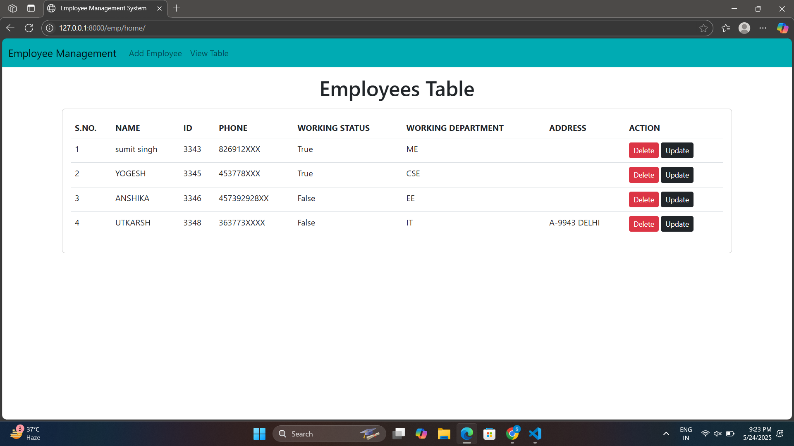

# Employee-management


images;

## 📋 Project Overview

The **Employee Management System** is a web-based CRUD application that enables users to manage employee records efficiently. Built with **Python**, **Django**, and **Bootstrap**, the system allows you to add, view, update, and delete employee information in a user-friendly interface.

## 🚀 Features

- Add Employee: Input Name, ID, Phone, Address, Department, and Working Status.
- Department Selection: Choose from a dropdown menu.
- Working Status: Toggle via checkbox.
- View Employees: All data displayed in a responsive table on the home page.
- Update Records: Reuse the same form with pre-filled data for easy editing.
- Delete Records: Remove employees instantly with auto-adjusted serial numbers.


## 🛠️ Installation

**Requirements**:
- Python 3.8+
- Django 4.0.4+

**Tech Stack**:
    Backend: Python, Django
    Frontend: HTML, CSS, Bootstrap
    IDE: VS Code Insiders

**To run locally**:

1. Clone the repository:
   ```sh
   git clone https://github.com/YourUsername/Employee-Management-System.git
   cd Employee-Management-System


2.   Install dependencies:
 pip install -r requirements.txt

3.  Run the server:
    python manage.py runserver

4.   Open your browser and navigate to:
    http://127.0.0.1:8000/

 🧑‍💻 Author
Sumit Singh Sengar   
    
